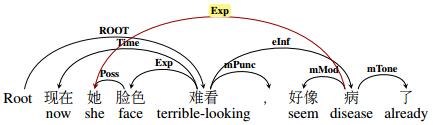
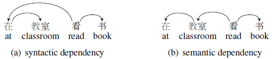
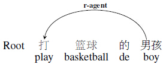
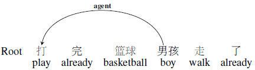
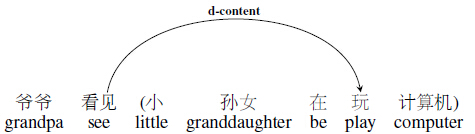
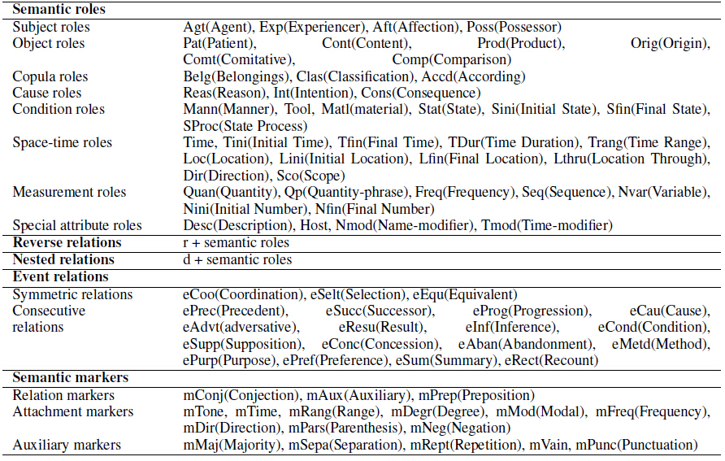
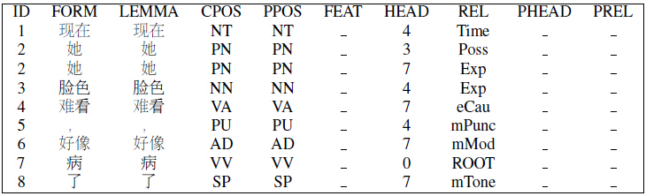

BH-SDP guidline
===============

**2015.04.30**

**BH is the abbreviation of Beijing Language & Culture University and Harbin Insititute of Technology.**

_Yanqiu Shao, Yu Ding_

Given a complete sentence, semantic dependency parsing(SDP) aims at determining all the word pairs related to each other semantically and assigning specific predefined semantic relations. Semantic dependency analysis represents the meaning of sentences by a collection of dependency word pairs and their corresponding relations. This procedure survives from syntactic variations.

Here we define a Chinese semantic dependency scheme based on Chinese sepecific linguistic knowledge, which represents the meaning of sentences in graphic formats. A complete annotation example is here:

Part I. Structure of Chinese Semantic Dependency Graph
======================================================

We used semantic dependency graphs to represent the meanings of sentences, which contain dependency relations between all the word pairs with direct semantic relations. Predicates includes most predicative constituents (i.e. most verbs and a small number of nouns and adjectives), and arguments are defined as all the possible participants in the real scene corresponding to a certain predicate (e.g. the eater, food, tool, location, time in the scene related to “eat”). One principle of building dependency arcs is to find arguments for predicates in content words preferentially because they are the ones that related to predicates directly. Unlike syntactic dependency, which inserts non-content words between predicate and its “real arguments” (see Fig. 1). Due to the completeness of the representation of relations between words, some words have relations with more than one other word (some words have more than one child, and some have more than one father), which forms direct acyclic graphs finally. We define a set of labels to describe dependency relations between words.

Figure1:
--------

Part II. Semantic Dependency Relations
======================================
On the basis of <a href="https://www.cs.york.ac.uk/semeval-2012/task5/">SemEval 2012 task 5</a>, we refined the semantic relation set in terms of more solid Chinese
linguistic theories, except for the reference of HowNet (Dong and Hao, 2010), a popular Chinese semantic thesaurus. We mainly referred to the idea of semantic network of Chinese grammar defined by Lu (2001). He adapted semantic network to Chinese, which is the formal network for “semantic composition systems” by distinguishing the hierarchies of “semantic relations”, “semantic alignment” and “semantic orientation”. We borrowed his ideas of semantic unit classification and semantic combination, and integrated them with the dependency grammar to re-divided boundary for each semantic relation and re-organized the total label set for clarity and definiteness.

Semantic units are divided from high to low into event chains, events, arguments, concepts and markers. Arguments refer to noun phrases related to certain predicates. Concepts are simple elements in basic human thought or content words in syntax. Markers represent the meaning attached to entity information conveyed by speakers (e.g., speakers’ tones or moods). These semantic units correspond to compound sentences, simple sentences, chunks, content words and function words. The meaning of sentences is expressed by event chains. Event chains consist of multiple simple sentences. The meaning of simple sentences is expressed by arguments, while arguments are reflected by predicate, referential or defining concepts. Markers are attached to concepts.

The meaning of sentences consists of the meaning of semantic units and their combinations, including semantic relations and attachments. Semantic attachments refer to markers on semantic units. Semantic relations are classified into symmetric and asymmetric types. Symmetric relations include coordination, selection, and equivalence relations, while asymmetric relations include:

  - _Collocational relations_ occur between core and non-core roles. For example, in “工人 (worker) 修理 (repair) 地下 (pipeline) 管道 (pipeline)” serves as a non-core role, and is the patient of “修理 (repair),” which is a verb and core role. Relations between predicates and nouns belong to collocational relations. Semantic roles usually refer to collocational relations, Table 1 presents the 32 semantic roles we defined, divided into eight small categories. 
  - _Additional relations_ refer to the modifying relations among concepts within an argument; all semantic roles are available, e.g. in “地下 (underground) 的 (de) 管道 (pipeline),” “地下 (underground)” is the modifier of “管道 (pipeline),” which refers to location relation.
  - _Connectional relations_ are bridging relations between two events that are neither symmetric nornested relation. For example, for “ 如果 (If) 天气 (weather)好 (good) ，(,) 我 (I) 就 (will) 去 (go) 故宫 (the Summer Palace),” the former event is the hypothesis of the latter. Events in Chinese semantic dependency have 15 relations.
  
According to the above classification of sentence hierarchies, we can get to know how each sentence component constitutes the entire meaning of sentences. We design semantic dependency relations in terms of this theoretical basis.

Part III. Special Situations
============================ 

On the analysis of the nature of Chinese language, two special situations need special handling. we list them here and describe their annotation strategies.

  - _Reverse relations_. When a verb modifies a noun, a reverse relation is assigned with the label r-XX(XX refers to a single-level semantic relation). Reverse relation is designed because a word pair with the same semantic relation appears in different sentences with different modifying orders. Reverse relation is used to distinguish them. For example, the verb “打 (play)” modifies the kernel word “男孩 (boy)” in (a) of Fig. 2, so r-agent is assigned; while in (b) “打 (play)” is a predicate and “男孩 (boy)” is the agent role with the label agent.
  - _Nested events_. We define another kind of special relation–nested relation to mark that one sentence is degraded as a constituent for another sentence.Two events have a nested relation, i.e., one event is degraded as a grammatical item of the other, which belong to two semantic hierarchies. For example, in the sentence in Fig.3, the event “小 (little) 孙女 (granddaughter) 在 (be) 玩 (play) 电脑 (computer)” is degraded as a content of the action of “看见 (see)”. A prefix “d” is added to single-level semantic relations as distinctive label.

Figure2：
--------

	
	

Figure3：
--------

Finally, we got 45 labels to describe relations between main semantic roles and relations within arguments,
19 labels for relations between different predicates. We also defined 17 labels to mark the
auxiliary information of predicates. The total semantic relation set is shown in Table 1.

Table1：
-------

Part V. Data Format
===================

All data provided for the task uses a column-based file format, similar to the one of the 2006 CoNLL Shared Task. Each training/developing/testing set is a text file, containing sentences separated by a blank line. Each sentence consists of more than one tokens, and each token is represented on one line consisting of 10 fields. Buchholz and Buchholz and Marsi (2006) provide more detailed information on the format. It’s worth noting that if one word has more than one heads, it will appear in more than one lines in the training/developing/testing files continuously. Fields are separated from each other by a tab. Only five of the 10 fields are used: token id, form, pos tagger, head, and deprel. Head denotes the semantic dependency of each word, and deprel denotes the corresponding semantic relations of the dependency. In the data, the lemma column is filled with the form and the cpostag column with the postag.

Reference
=========
  - Chuan Lu. 2001. The Semantic Network of Chinese Grammar. The Commercial Printing house.
  - Sabine Buchholz and Erwin Marsi. 2006. Conll-x shared task on multilingual dependency parsing. In Proceedings of the Tenth Conference on Computational Natural Language Learning, pages 149–164. Association for Computational Linguistics.
  - Zhendong Dong, Qiang Dong and Changling Hao. 2010. HowNet and Its Computation of Meaning. In Proceedings of the 23rd International Conference on Computational Linguistics: Demonstrations, pages 53–56.
